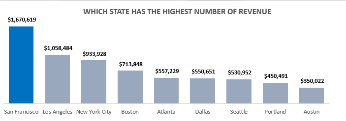

# SALES-ANALYSIS
## by Emmanuella iyogwoya
___

___
# INTRODUCTION
___
In this project, I aimed to uncover trends and patterns for sales in the first quarter. I utilized advanced excel functions to clean and preprocess the data before analyzing with excel built-in functions  .
## PROBLEM STATEMENT
I tried to solve the following problems with this datasets;
* Which product is best selling in terms of quantity and revenue
* Which state is generating the highest number of revenue
___
# DATA SOURCING
___
The datasets used were provided by my teacher for academic purposes
___
# SKILLS DEMONSTRATION
___
* I used advanced excel functions like XLOOKUP to help in cleaning and retrieving informations within my data sets.
* I wrote complex excel formulas by combining IF, OR, AND to solve problems.
* I cleaned and preprocessed the data by using excel formulas to handle duplicates,errors and format inconsistencies to ensure accurate and reliable data.
* I summarized the data sets using PivotTables and also used PivotCharts to visualise the summarized data dynamically
___
# ANALYSIS AND VISUALIZATION
___
This project has one page/dashboard

### Which state is generating the highest number of revenue

___
# RECOMMENDATIONS AND CONCLUSIONS
___
* Offering special bundles or packages including products (say macbook) with complementary products or accessories which will entice customers to purchase more can boost overall revenue for months like January with low sales.
* Create educational content such as blogs, posts, videos or FAQs that showcase advantages of owning a dryer and provide tips on how to use the right model can educate customers on any concens or misconceptions they may have about LG dryers can help increase the rate at which dryers were sold considering they were sold the least overall this time period.
* Even if AAA Battries (4-pack) is the best selling in order quantity, it generated the least revenue. We could review the pricing startegies of AAA Battries (4-pack) to enusre they are competitive in the market. 
* Gathering feedback from customers in San Fransisco (which had the highest number oforders and revenue) and Austin (which has the lowest number of orders and revenue) understand any differences in preferences or needs. Use this feedback to adjust the marketing strategies in Austin.
